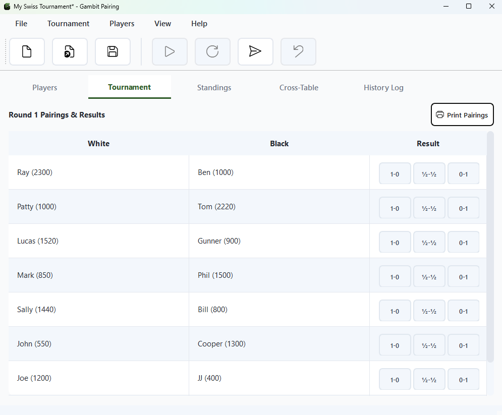
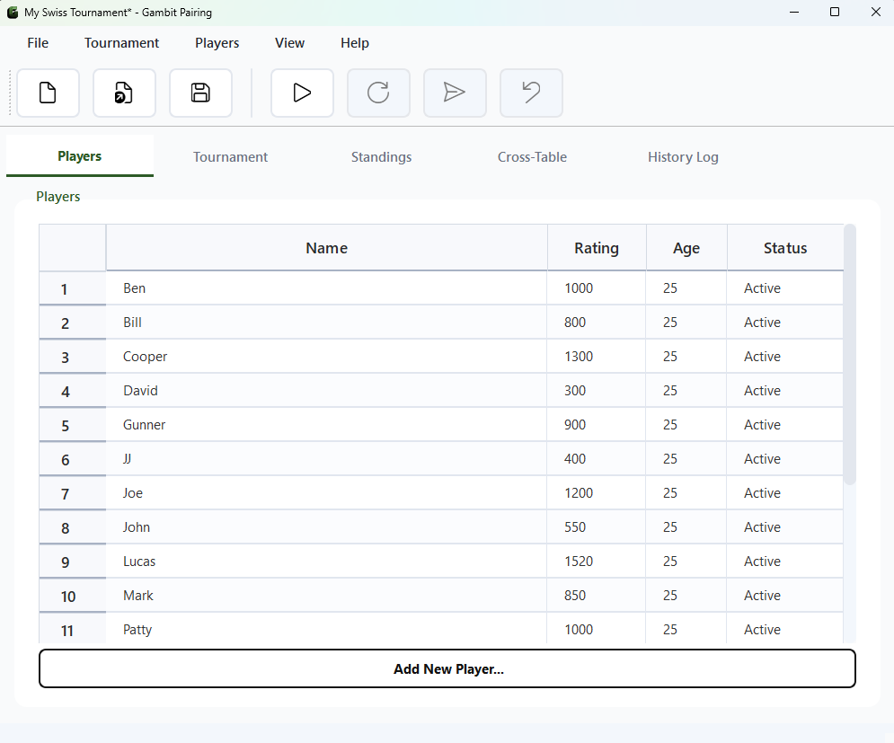
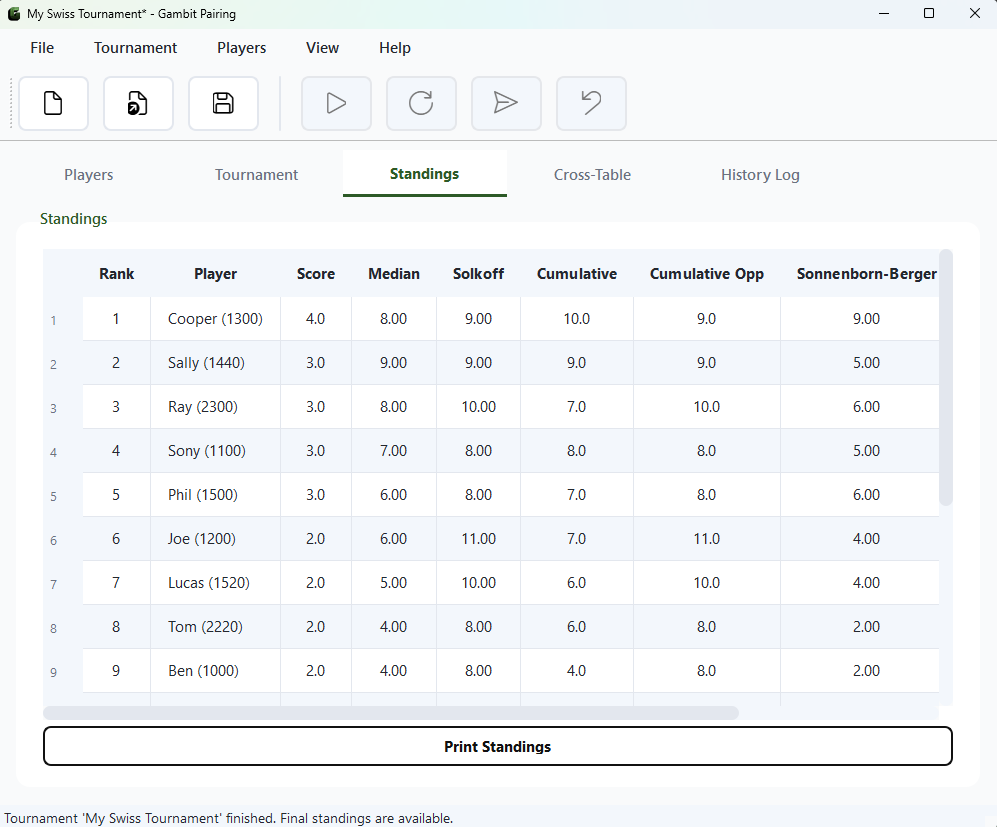
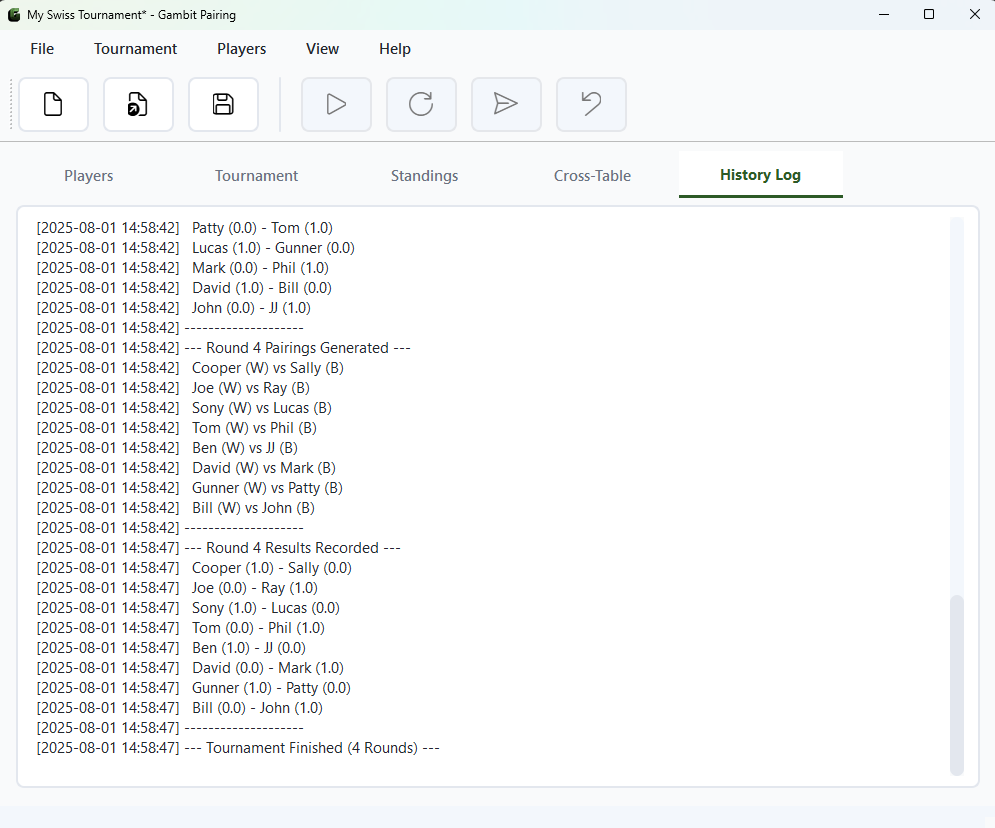
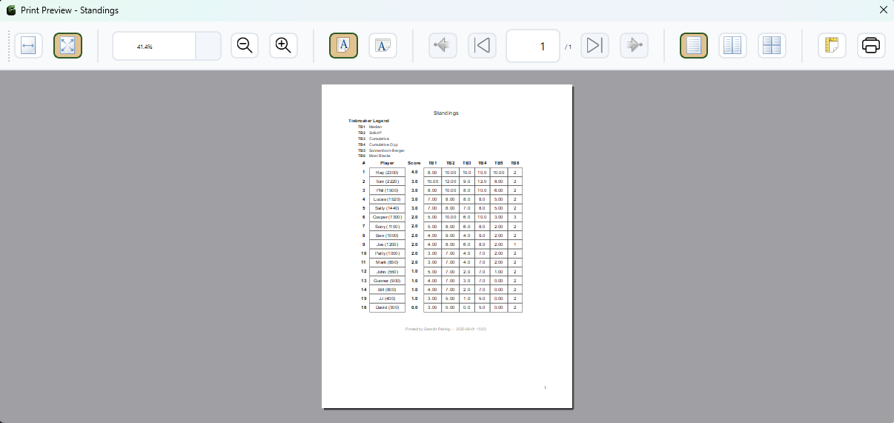

```

 $$$$$$\                       $$\      $$\  $$\
$$  __$$\                      $$ |     \__| $$ |
$$ /  \__|$$$$$$\ $$$$$$\$$$$\ $$$$$$$\ $$\$$$$$$\
$$ |$$$$\ \____$$\$$  _$$  _$$\$$  __$$\$$ \_$$  _|
$$ |\_$$ |$$$$$$$ $$ / $$ / $$ $$ |  $$ $$ | $$ |
$$ |  $$ $$  __$$ $$ | $$ | $$ $$ |  $$ $$ | $$ |$$\
\$$$$$$  \$$$$$$$ $$ | $$ | $$ $$$$$$$  $$ | \$$$$  |
 \______/ \_______\__| \__| \__\_______/\__|  \____/
$$$$$$$\         $$\         $$\
$$  __$$\        \__|        \__|
$$ |  $$ $$$$$$\ $$\ $$$$$$\ $$\$$$$$$$\  $$$$$$\
$$$$$$$  \____$$\$$ $$  __$$\$$ $$  __$$\$$  __$$\
$$  ____/$$$$$$$ $$ $$ |  \__$$ $$ |  $$ $$ /  $$ |
$$ |    $$  __$$ $$ $$ |     $$ $$ |  $$ $$ |  $$ |
$$ |    \$$$$$$$ $$ $$ |     $$ $$ |  $$ \$$$$$$$ |
\__|     \_______\__\__|     \__\__|  \__|\____$$ |
                                         $$\   $$ |
                                         \$$$$$$  |
                                          \______/


  ___     ___       __      .______    __    __       ___           ___       _  _       __  ___
 /  /    /   \     |  |     |   _  \  |  |  |  |     /   \         / _ \     | || |     /_ | \  \
|  |    /  ^  \    |  |     |  |_)  | |  |__|  |    /  ^  \       | | | |    | || |_     | |  |  |
|  |   /  /_\  \   |  |     |   ___/  |   __   |   /  /_\  \      | | | |    |__   _|    | |  |  |
|  |  /  _____  \  |  `----.|  |      |  |  |  |  /  _____  \     | |_| |  __   | |    __| |  |  |
|  | /__/     \__\ |_______|| _|      |__|  |__| /__/     \__\     \___/  (__)  |_|   (__)_|  |  |
 \__\                                                                                        /__/

```
[](https://opensource.org/licenses/MIT)
[](https://www.python.org/)
[](https://riverbankcomputing.com/software/pyqt/intro)
[](https://discord.gg/eEnnetMDfr)

**Important:** Gambit Pairing is in alpha development (version 0.4.1). Features and stability are not guaranteed.

[Join our Discord](https://discord.gg/eEnnetMDfr)

Gambit Pairing is a desktop application for managing Swiss-system chess tournaments. It provides a modern graphical user interface (GUI) built with PyQt6, supporting USCF-style pairings, tiebreaks, and tournament management.

## Features

- **Modern User Interface**
  - Polished, high-contrast, accessible UI with custom stylesheets.
  - Tabbed interface: Players, Tournament Control, Standings, Cross-Table, History Log.
  - Tooltips, context menus, and responsive layouts.
  - Print preview dialogs for pairings and standings.

- **Player Management**
  - Add, edit, withdraw/reactivate, and remove players.
  - Manage detailed player info: name, rating, gender, date of birth, phone, email, club, federation.
  - Import/export player lists/details from/to CSV or text files.

- **Tournament Setup**
  - Configure number of rounds and tiebreak order (Median, Solkoff, Cumulative, etc.).
  - Save/load tournaments to/from disk (`.json` files, JSON format).
  - Full tiebreaker configuration with drag-and-drop order in settings.

- **Swiss Pairings**
  - Automated pairings for each round, avoiding rematches and balancing colors.
  - Manual adjustment of pairings before results are entered (with dialog).
  - Bye assignment according to USCF rules, including handling of inactive/withdrawn players.

- **Results Entry**
  - Enter round results via an interactive table with quick result buttons.
  - Auto-set results for inactive players.
  - Undo last round's results.

- **Standings & Tiebreaks**
  - Standings table with configurable tiebreak columns.
  - Cross-table view showing all results.
  - Tiebreaker legend in printouts.
  - Support for Median, Solkoff, Cumulative, Sonnenborn-Berger, Most Blacks, and more.

- **Print & Export**
  - Print pairings, standings, or player lists directly from the application.
  - Print preview and printer selection supported.
  - Export standings and player lists to CSV or text.

- **History & Logging**
  - Detailed history log of actions, pairings, and results.
  - Exportable log.
  - Logging to file and console for debugging.

- **Update Checker**
  - Built-in update checker for packaged releases.
  - Modern dialogs for update prompts and progress.
  - Automatic and manual update checks.

## Requirements
> see requirements.txt
## Installation

1. Install Python 3.8 or higher.
2. Install all required dependencies using `requirements.txt`:
    ```bash
    pip install -r requirements.txt
    ```
3. Download or clone this repository.

## Usage

1. Run the application:
    ```bash
    python main.py
    ```
2. **Create or Load a Tournament:**
    - Use "File > New Tournament..." or "File > Load Tournament..." to start.
    - Configure rounds and tiebreaks in "Settings".
3. **Add Players:**
    - Enter player details (name, rating, gender, etc.) and click "Add New Player...".
    - Import players from CSV via "File > Import Players from CSV...".
    - Edit, withdraw/reactivate, or remove players via right-click context menu.
4. **Start Tournament:**
    - Click "Start Tournament" when ready.
    - No further player additions/removals after starting.
5. **Pairings and Results:**
    - Prepare next round and enter results in the pairings table.
    - Use quick result buttons or select from the dropdown.
    - Manually adjust pairings if needed (right-click pairing row).
    - Undo last round's results if necessary.
6. **Standings & Cross-Table:**
    - View current standings and tiebreaks in the Standings tab.
    - View all results in the Cross-Table tab.
7. **Print:**
    - Print pairings, standings, or player lists via the "File > Print..." menu.
    - Use print preview and select your printer before printing.
8. **Export & Save:**
    - Export standings or player lists via the File menu.
    - Save or load tournaments at any time.
9. **History:**
    - Review all actions and results in the History Log tab.
10. **Check for Updates:**
    - Use "Help > Check for Updates..." to check for new versions (packaged releases only).

## Notes

- The pairing algorithm follows USCF-style Swiss rules, including color balancing and bye assignment.
- Tiebreak order is fully configurable and reflected in the standings and printouts.
- Manual pairing adjustments are logged and cannot be undone automatically.
- Tournament data is saved in `.json` files (JSON format).
- This is an alpha version (0.4.1); please report bugs or suggestions via [Discord](https://discord.gg/eEnnetMDfr) or make an issue on Github.

## License

This project is open source and available under the [MIT License](https://mit-license.org/).

## Screenshots

> _Below are some example screenshots of Gambit Pairing in action._

**Tournament Control Tab**


**Player Manager Tab**


**Standings Tab**


**Cross-Table Tab**


**History Log Tab**


**Print Dialog**

